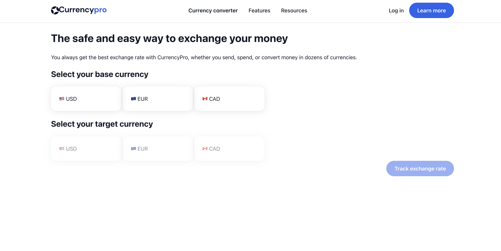

# CurrencyPro

<p align="center">
  
</p>
_CurrencyPro – currency selection and conversion flow_

CurrencyPro is a front-end Typescript/JavaScript project that allows users to view live foreign currency exchange rates by selecting a base currency and a target currency. The app fetches real-time conversion data from the Exchange Rate API and displays the result on a dedicated results page.

This project focuses on clean DOM state management, API integration, accessibility, and guided user interaction.

---

## Overview

**User flow:**

1. Select a base currency
2. Select a target currency
3. Navigate to a results page displaying the live conversion rate

The app prevents invalid selections (e.g. `USD → USD`) and guides the user step-by-step for a better UX.

---

## Concepts Practiced

This project was built to practice and reinforce:

- Reading and implementing API documentation
- Using the Fetch API with authentication
- Managing application state with the DOM
- Accessible UI patterns (ARIA, disabled states)
- Page navigation using URL parameters
- UI state synchronization between views

---

## Tech Stack

- **Typescript**
- **JavaScript (ES Modules)**
- **HTML5**
- **CSS3**
- **Fetch API**
- **Exchange Rate API**

---

## API

Currency data is fetched from:

- **Exchange Rate API**
  https://www.exchangerate-api.com/

---

## Design Reference

The UI is based on the provided Figma design:

- **Figma file:**
  https://www.figma.com/design/0fqg6mYPiyI7JVmKgbhADd/CurrencyPRO---Learn-JavaScript-Projects

---

## Project Instructions

This project follows the specification from Learn JavaScript Online:

- **Project steps:**
  https://learnjavascript.online/projects/currency-pro.html

---

## Key Features

- Base and target currency selection
- Prevention of invalid currency pairs
- Live exchange rate fetching
- Accessible navigation and controls
- Clean separation of logic between pages

---

## Planned Improvements

Features still to be implemented:

1. Finalize and polish CSS layout
2. Improve mobile responsiveness
3. Add loading and error states
4. Finalize and deploy

---

## Getting Started

```bash
pnpm install
pnpm run dev
```
